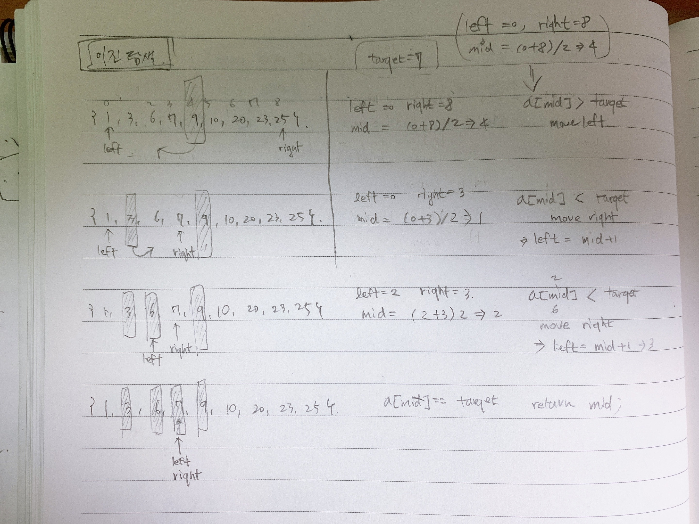

# 이진탐색
> 이진탐색 문제들의 유형들을 정리해보자.

이진탐색은 반복문, 재귀문으로 모두 풀수 있다. 반복문, 재귀문 모두 연습해보면 좋다. 개인적으로는 스택오버플러우 때문에 반복문을 선호하기는 하지만 사고방식의 유연성을 잃지 않으려면 재귀방식도 꾸준히 연습해야 한다.  
이진 탐색은 반드시 정렬된 배열에 대해서 동작한다. 따라서 문제에서 이진탐색을 사용해야 하는 경우가 발생하면, 정렬된 입력값인지 먼저 검토하고 정렬이 안되어 있다면 정렬을 먼저 수행하고 진행해야 한다. 
물론 nlogn 복잡도를 가지는 정렬을 사용하는 것이 좋다.  
  
이진 탐색을 공부할 때 중요한 점 중 하나는 숫자형의 타입을 넘어서는 경우에 대한 처리를 해주어야 한다는 점이다. 이에 대한 처리 역시 아래에서 정리할 예정이다.  

# 이진탐색의 기본적 풀이

이진탐색은 반복문, 재귀문으로 모두 풀어낼 수 있다. 그리고 정수와 같은 자료형의 left + right 연산을 수행할 때 프로그래밍 언어에서 지정하고 있는 숫자타입의 한도를 넘어가는 경우가 있다.  
이런 이유로 아래와 같이 별도의 연산을 통해 버그를 피하기도 한다.
> int mid = left + (right-left)/2; // left + right 시 자료형의 범위를 벗어나는 경우가 있기 때문

# 출제 유형들
- 정렬된 배열 내에서 원하는 숫자 찾기
- 정렬된 배열 내에서 원하는 숫자보다 작은 숫자들의 갯수 구하기
- 정렬된 배열이지만, 회전/순환 구조의 배열에서의 정렬된 배열에서 숫자 검색하기
    - [leetCode](https://leetcode.com/problems/search-in-rotated-sorted-array/)
- 두 배열의 교집합
    - [leetCode](https://leetcode.com/problems/intersection-of-two-arrays/)
    - 한쪽은 순서대로 탐색하고 다른 쪽은 정렬해서 이진 검색으로 값을 으면 검색 효율을 획기적으로 높일 수 있음
- 두 수의 합 II
    - [leetCode](https://leetcode.com/problems/two-sum-ii-input-array-is-sorted/)
- 2D 행렬 검색 II
    - [leetCode](https://leetcode.com/problems/search-a-2d-matrix-ii/)    
