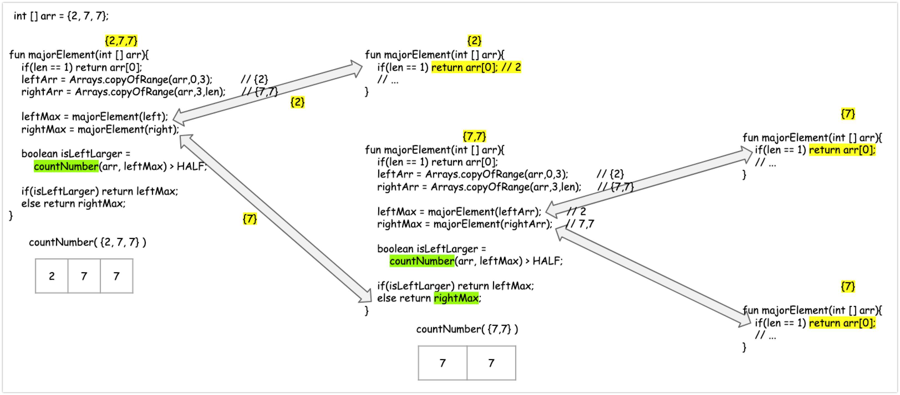

# 과반수 투표
# 출처
- [169. Majority Element](https://leetcode.com/problems/majority-element/)

# 문제
```plain
Given an array nums of size n, return the majority element.
The majority element is the element that appears more than ⌊n / 2⌋ times. You may assume that the majority element always exists in the array.
```
- size가 n 인 배열 `nums` 가 있을 때, `majority element` 를 리턴한다.
- (배열 사이즈 n)/2 이상 나타나는 요소가 과반수 요소(majority element)이다.
- 문제의 가정은 배열 내에 항상 과반수 엘리먼트가 존재한다는 것이다.

# 예제 
## e.g. 1) 
```plain
Input: nums = [3,2,3]
Output: 3
```

## e.g. 2)
```plain
Input: nums = [2,2,1,1,1,2,2]
Output: 2
```

# 문제 접근 방식
문제를 풀어낼 수 있는 방식은 3가지 이다.
- 브루트 포스 접근방식
    - 단순 무식한 방식이다.
- 다이나믹 프로그래밍 (기억법)
- 분할정복 

## 1. 브루트 포스 접근방식 :: 가장 단순무식한 방식
가장 단순한 방식인데, 효율성에서 좋지 않다. 
```python
def majorityElement(self, nums:List[int]) -> int:
    for num in nums:
        if nums.count(num) > len(nums) // 2:
            return num
```

### 참고) // 연산자
결과가 실수일때 내림 처리를 하고 동일한 자료형을 리턴해주는 파이썬 특유의 편리한 연산자이다.  
```plain
>>> 5/3
1.6666666666666667
>>> 5//3
1
```

## 2. 다이나믹 프로그래밍
기억방식을 통해서 조금 더 효율적으로 수행할 수 있도록 해준다. 개인적으로는 다이나믹 프로그래밍을 사용해서 계산하는것이 제일 효율적인것 같다는 생각이다.   
오늘 풀어볼 문제는 분할 정복이기에 다이나믹 프로그래밍은 건너뛰기로 했다.  
(아래의 python 코드에서는 배열에 저장해서 사용하지만, 딕셔너리나 맵에 저장해두고 사용하는 것 역시 좋은 방법)
```python
def majorityElement(selef, nums: List[int]) -> int:
    counts = collections.defaultdict(int)
    for num in nums:
        if counts[num] == 0:
            counts[num] = nums.count(num)
        if counts[num] > len(nums) // 2:
            return num
```

## 3. 분할정복
### python (psuedo-code) 
```python
def majorElement(self, nums: List[int]) -> int:
    if not nums:
        return None
    if len(nums) == 1:
        return nums[0]

    a = self.majorElement(nums[:len(nums) // 2]
    b = self.majorElement(nums[len(nums) // 2 :]

    return [b,a][nums.count(a) > len(nums) // 2]
```

### 문제풀이 절차 (procedure)
분할정복으로 풀 경우 아래와 같은 절차를 거쳐 풀이된다.

