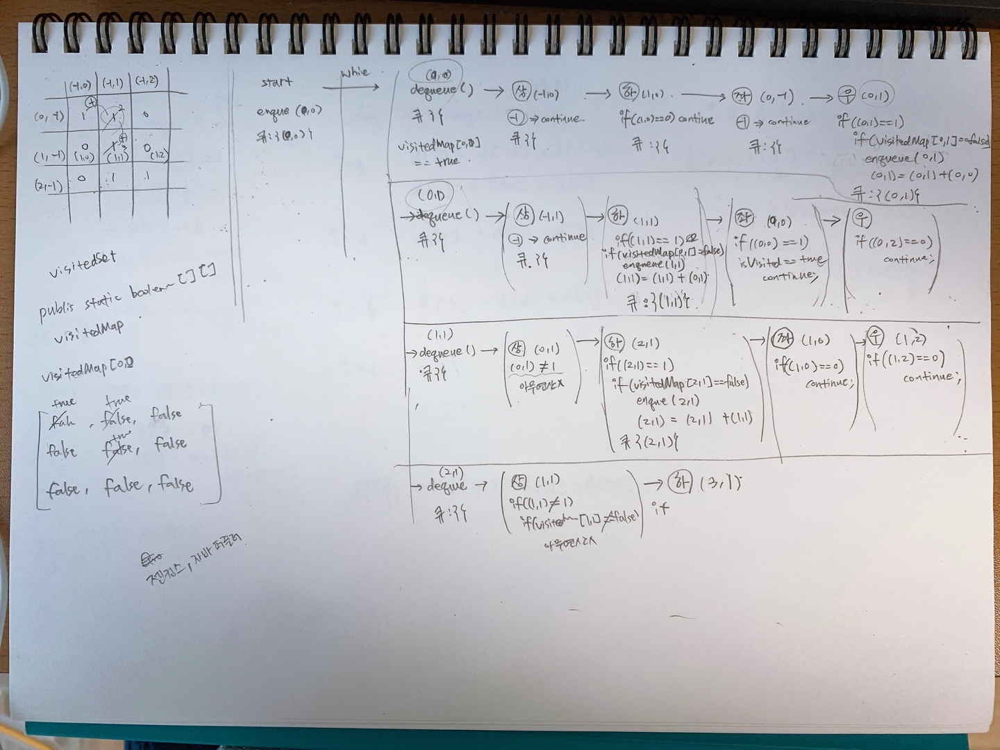

# 미로 탐색문제
> 문제 출처 : [이것이 취업을 위한 코딩테스트다 - yes24, 나동빈 저](http://www.yes24.com/Product/Goods/91433923?OzSrank=1)
미로에서 0은 벽이고 1은 길이다. (0,0) 에서 시작하여 (2,2) 까지 갈 수 있는 길의 길이를 구해보자. (사실 이게 정확한지는 잘 모르겠다. 다른 책 역시도 찾아보고 공부해야 한다.)
```plain
[1,1,0]
[0,1,0]
[0,1,1]
```
  
## 부교재로 참고할 책들
자료구조를 자주 풀어보던 학부시절에는 DFS로 풀었던 예제를 본것 같기도 했다. 해당 내용들을 아래 책들로 찾아봐야 할 듯 하다. 학교다닐때 쓰던 교재는 이제 절판이군...
- http://www.yes24.com/Product/Goods/42415865
- http://www.yes24.com/Product/Goods/69750539?OzSrank=1
- http://www.yes24.com/Product/Goods/44305533?OzSrank=3
- http://www.yes24.com/Product/Goods/69750539
  
## 문제풀이 과정  
문제를 풀어보기 위해 그림을 그려본 과정을 아래에 사진으로 남겨봤다. 항상 느끼는 것이지만 알고리즘은 눈으로 보고 코드를 치면 안되는 것 같다.  
이런 점에서 수학(시험)공부와 유사하다는 점이 있는 듯 하다. 암기와 끈기, 손으로 연습장에 직접 문제를 풀어보는 습관이 수학성적에 중요하기 때문이다.


