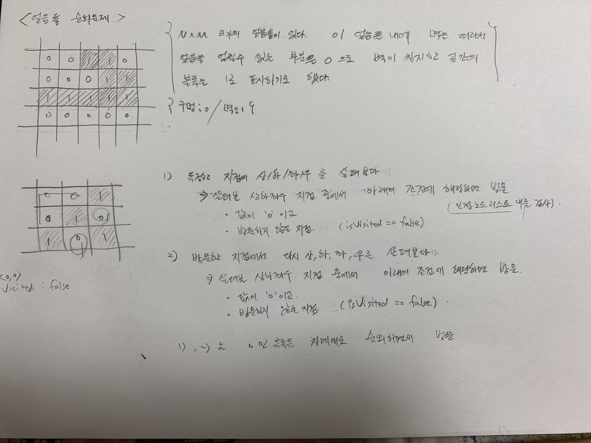
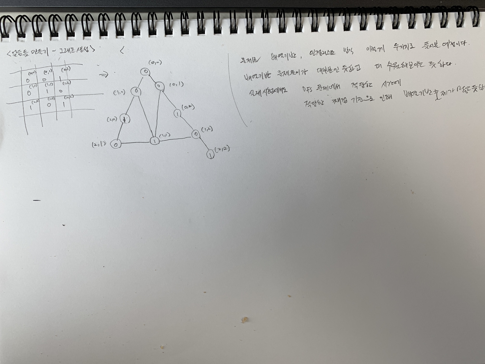

[TOC]

# 얼음틀 순회문제 (단순 얼음틀 문제)
N x M 크기의 얼음틀이 있다. 이 얼음틀 내에 벽을 따라서 얼음 또는 벽을 표시할 때 아래와 같이 표시하기로 했다.
- 얼음을 얼릴수 있는 공간 : 0
- 벽이 위치한 공간의 블록 : 1
{구멍 : 0, 벽: 1}

# 문제풀이 아이디어 = DFS
미로 등을 푸는 것과는 다르게 위의 경우 짧은 길이 아니라 들를수 있는 모든 길을 찾는 것이 목표이다. 들를 수 있는 모든 길을 처음부터 끝까지 막다른 길이 나올때까지 나아갔다가 돌아오는 것을 반복하여 찾다보면 얼음이 위치할 수 있는 길을 찾게 된다. 즉, DFS 방식으로 탐색하다보면 얼음이 어떻게 만들어지게 되는지 구할 수 있게 된다.

# 그래프 생성 (인접리스트 방식)
일단 문제를 풀기 위해서는 그래프를 입력해야 한다. 
배열 기반의 경우 for문으로 입력받은 것을 그래프로 입력하기 편하다. 시험 출제시 DFS의 개념만을 체크하기 위한 조건으로 배열기반의 응용문제 출제들이 많은듯 하다.
그런데... 일단, 오늘 문제 풀이에서는 일단 인접리스트 방식을 먼저 정리해보려고 한다.

