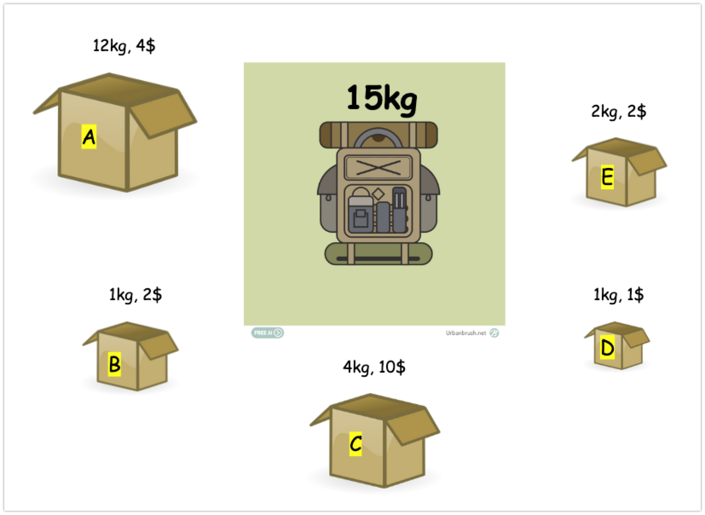

# 배낭문제 (분할 가능 배낭문제)
# 이미지 출처
- [https://www.urbanbrush.net/downloads/%EB%B0%B0%EB%82%AD%EC%97%AC%ED%96%89-%EC%9D%BC%EB%9F%AC%EC%8A%A4%ED%8A%B8-ai-%EB%AC%B4%EB%A3%8C%EB%8B%A4%EC%9A%B4%EB%A1%9C%EB%93%9C-free-backpacking-vector/](https://www.urbanbrush.net/downloads/%EB%B0%B0%EB%82%AD%EC%97%AC%ED%96%89-%EC%9D%BC%EB%9F%AC%EC%8A%A4%ED%8A%B8-ai-%EB%AC%B4%EB%A3%8C%EB%8B%A4%EC%9A%B4%EB%A1%9C%EB%93%9C-free-backpacking-vector/)

# 문제 설명
배낭이 있다. 배낭에 채울수 있는 박스의 최대 중량은 15kg 이다.
그리고 각 배낭의 무게와 배낭의 가격은 아래와 같다.
 

- 배낭 A
    - 12kg, 4$
    - 4/12 $
- 배낭 B
    - 1kg, 2$
    - 1kg 당 2$
- 배낭 C
    - 4kg, 10$
    - 1kg 당 2.5$
- 배낭 D
    - 1kg, 1$
    - 1kg 당 1$
- 배낭 E
    - 2kg, 2$
    - 1kg 당 1$

15 kg 을 채워야 하는데, 이 무게를 모두 가장 높은 가격으로 채울 경우 얼마의 가격이 되는지 구해보세요.

