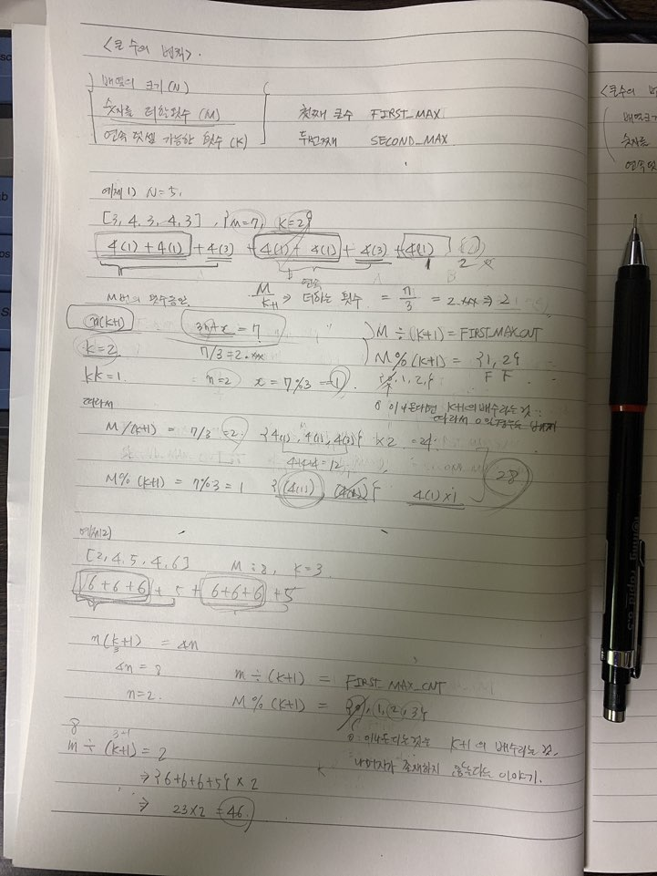

# 큰수의 법칙
# 참고자료
- [이것이 취업을 위한 코딩테스트다 with 파이썬, 나동빈 저](http://www.yes24.com/Product/Goods/93519145?OzSrank=2)

# 요약
주어진 수들이 리스트로 존재한다. 이 리스트에 있는 수 들을 이용해서 만들수 있는 가장 큰 수를 구하는 문제.

# 큰수의 법칙
**큰수의 법칙**은 일반적으로 통계 분야에서 다루어지는 내용이다. 하지만 동빈이는 본인만의 방식으로 다르게 사용하고 있다.  
동빈이의 **큰 수의 법칙**은 다양한 수로 이루어진 배열이 있을 때 주어진 수들을 M번 더하야 가장 큰 수를 만드는 법칙이다. 
단, 배열 내의 특정 인덱스에 해당하는 수가 K번을 초과하여 연속으로 더해질 수 없다.  

# 예제 1)
순서대로 2,4,5,4,6 으로 이루어진 배열이 있을 때 M이 8이고, K가 3이라고 가정해보자.  
즉, 숫자를 원하는 대로 여덟번(M) 더하는데, 특정 인덱스의 수를 3번(K) 연속으로 더하는 것 까지 가능하다. (4번 연속으로 더하는 것 부터 불가능)   
```plain
6 + 6 + 6 + 5 + 6 + 6 + 6 + 5
```

# 예제 2)
서로 다른 인덱스에 같은 수가 중복되어 나타나는 배열에 대해서도 풀어보자.  
순서대로 3,4,3,4,3 으로 이루어진 배열이 있다. M이 7이고, K가 2이다.  
숫자를 원하는 대로 7번 더하도록 하는데, 특정 인덱스의 특정 숫자를 2번 이상 더할 수 없는 경우이다.
```plain
4(i=1) + 4(i=1) + 4(i=3) + 4(i=3) + 4(i=1) + 4(i=1) + 4(i=3) = 28
```

# 문제
배열 사이즈 N, 숫자를 더할 횟수 M, 연속 덧셈 가능한 횟수 K 가 있다고 하자. M, N, K 모두 10000 보다 작거나 같다.  
이 때 N, M, K 와 배열을 입력받아서 만들어낼 수 있는 숫자를 리턴하는 함수 answer 를 만들어보자.

ex)
N을 입력하세요 : 5
M을 입력하세요 : 8
K를 입력하세요 : 3
배열을 입력해주세요!! (공백으로 구분, 개행문자 No) ::
2 4 5 4 6

# 출력
46  

# 아이디어 떠올리기
코딩테스트 연습을 하는 것은 사고력을 키워나가는 과정이라는 것을 느껴가고 있다. 이전에 배우던 자료구조의 틀에서 벗어나서 그리디 문제들을 풀어보는게 재밌다.    
알고리즘 문제를 풀다보면 아래의 과정을 거치게 되는 것 같다.  
- 수 또는 문자열을 나열을 해본다.
- 규칙을 찾는다.
- 수식을 만들어낸다.
인적성 수리영역과목 대비를 하다가 중간에 멈추긴 했는데, 이런 이유로 굉장히 조급해지고 그랬는데 2월달부터 다시 시작하게 될 것 같다.    
근데... 알고리즘 문제 풀이를 하는 과정 역시 인적성 대비에 어느정도 도움이 되는 것 같다는 기분이 많이 들어서 조금은 안심이 된다.    

# 출력결과
## 2021/01/10
```plain
배열의 크기(N)를 입력해주세요 :: (숫자 입력후 Enter키 입력)
5
숫자를 더할 횟수(M)를 입력해주세요 :: (숫자 입력후 Enter키 입력)
8
연속 덧셈 가능한 횟수(K)를 입력해주세요 :: (숫자 입력후 Enter키 입력)
3
숫자의 배열을 입력하세요 :: (공백으로 구분, Enter키 입력하여 배열 생성 종료)
2 4 5 4 6
입력하신 데이터 = [2, 4, 5, 4, 6]

연산결과입니다 :: 46
```


## 2021/01/10
더 정리해서 깔끔하게 정리된 것은 추후 올려볼 예정이다. 우선은 처음 문제풀이를 하면서 너저분하게 정리한 내용 역시 있으면 나중에 볼때 훨씬 기억이 잘 날 것 같아서 남겨봤다.
 
