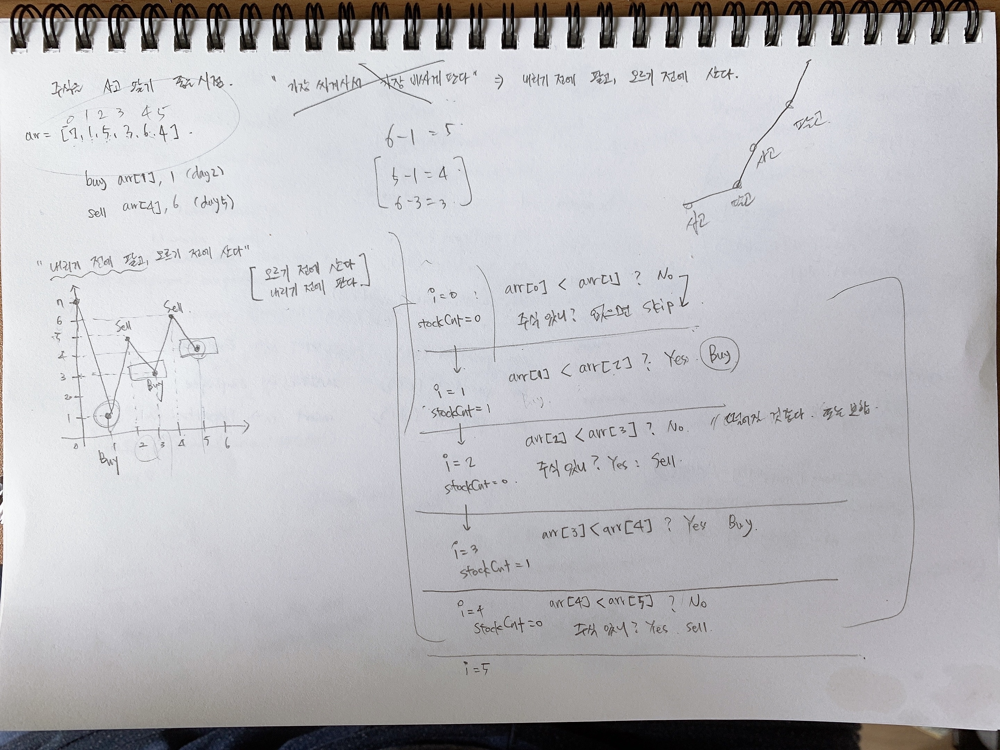

# 주식 사고팔기 - 그리디 알고리즘  

# 난이도 :: Easy

# 참고자료
[Best Time to Buy and Sell Stock II - LeetCode](https://leetcode.com/problems/best-time-to-buy-and-sell-stock-ii/)

# 문제내용  
Say you have an array prices for which the ith element is the price of a given stock on day i.  
Design an algorithm to find the maximum profit. You may complete as many transactions as you like (i.e., buy one and sell one share of the stock multiple times).  
Note: You may not engage in multiple transactions at the same time (i.e., you must sell the stock before you buy again).  

## ex 1)
```plain
Input: [7,1,5,3,6,4]
Output: 7
Explanation: Buy on day 2 (price = 1) and sell on day 3 (price = 5), profit = 5-1 = 4.
             Then buy on day 4 (price = 3) and sell on day 5 (price = 6), profit = 6-3 = 3.
```

## ex 2)
```plain
Input: [1,2,3,4,5]
Output: 4
Explanation: Buy on day 1 (price = 1) and sell on day 5 (price = 5), profit = 5-1 = 4.
             Note that you cannot buy on day 1, buy on day 2 and sell them later, as you are
             engaging multiple transactions at the same time. You must sell before buying again.
```

## ex 3)
```plain
Input: [7,6,4,3,1]
Output: 0
Explanation: In this case, no transaction is done, i.e. max profit = 0.
```

# 문제 풀이과정
  
  
  


