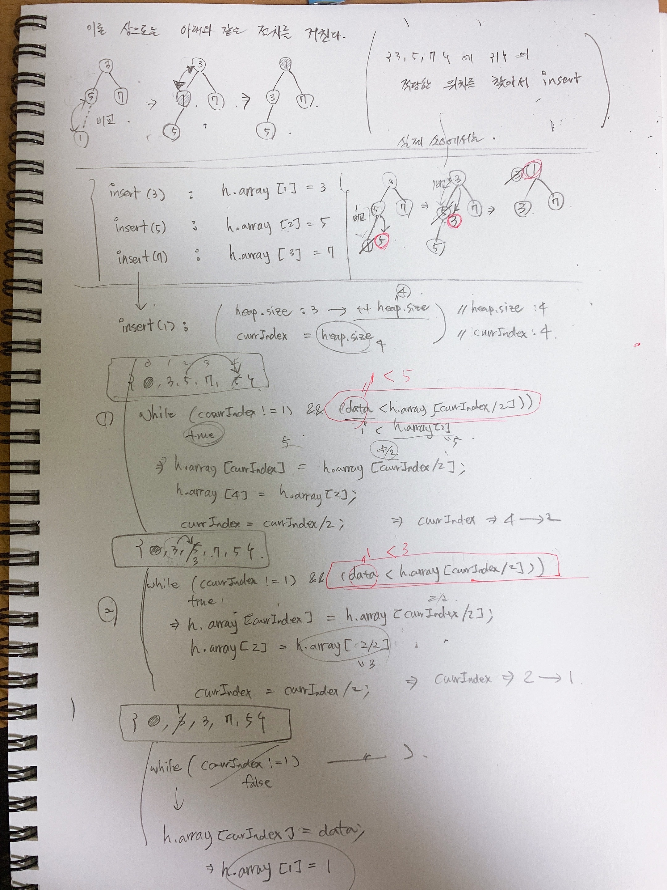

# 최소힙
# 삽입연산
최소힙의 기본적인 코드는 아래와 같다.
```java
public class MinHeapInsert_Example{
    // ...
	public static void insert(Heap h, int data){
		int currentIndex = ++h.size;

		while((currentIndex!=1) && (data < h.array[currentIndex/2])){
			h.array[currentIndex] = h.array[currentIndex/2];
			currentIndex = currentIndex/2;
		}

		h.array[currentIndex] = data;
	}
    // ...
}
```
최소힙 구조에서 노드의 삽입연산을 하는 절차를 그림으로 표현해보면 아래와 같다.



# 삭제연산 
