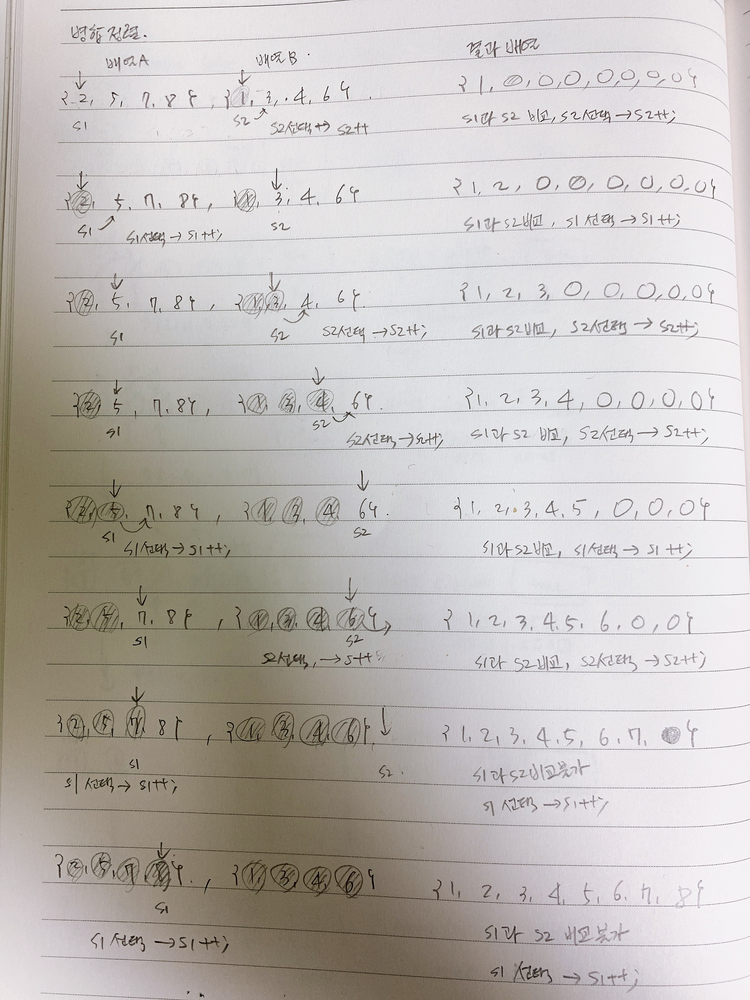

# 병합정렬
퀵정렬에서는 파티션, partion 함수를 이해하는 것이 중요한 개념이기도 하고 큰 러닝커브이다.  
병합정렬에서는 마지막 요소들을 합칠때 정렬해서 병합해야 하는데 이 병합할때의 로직이 러닝커브가 된다.  
분할 정복을 배우면서 다른 문제들을 이해하지 못하게 되는 경우가 꽤 있는데, 병합정렬을 먼저 이해하고 넘어가면 조금이나마 빠르게 이해하게 되는 것 같다.  
  
# 참고자료
- [C언어로 쉽게 풀어쓴 자료구조](http://www.yes24.com/Product/Goods/69750539)
  
# 병합정렬의 병합시의 정렬로직
병합정렬에서 가장 중요한 로직이자 처음 배울때 어려움을 느끼는 병합(merge)로직을 살펴보자.  
병합(merge)로직은 병합을 수행하면서 정렬을 수행하면서 병합을 수행하게 된다.  

  
 