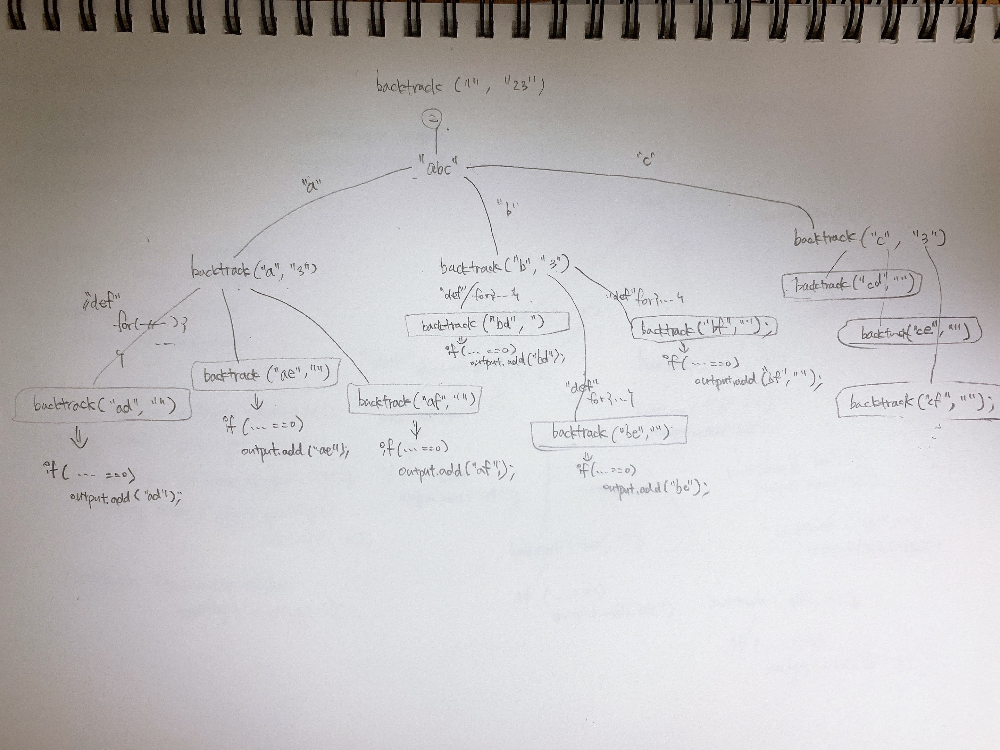

# Letter Combinations of a Phone Number
# 출처
[Letter Combinations of a Phone Number](https://leetcode.com/problems/letter-combinations-of-a-phone-number/)

# 유사 유형의 문제들
- [Medium - Generate Parentheses](https://leetcode.com/problems/generate-parentheses/)
- [Medium - Combination Sum](https://leetcode.com/problems/combination-sum/)
- [Easy - Binary Watch](https://leetcode.com/problems/binary-watch/)  
  
# Related Topics
- [String](https://leetcode.com/tag/string/)
- [Backtracking](https://leetcode.com/tag/backtracking/)
- [Depth-first Search](https://leetcode.com/tag/depth-first-search/)
- [Recursion](https://leetcode.com/tag/recursion/)
  

# 문제풀이
## 손그림

  
