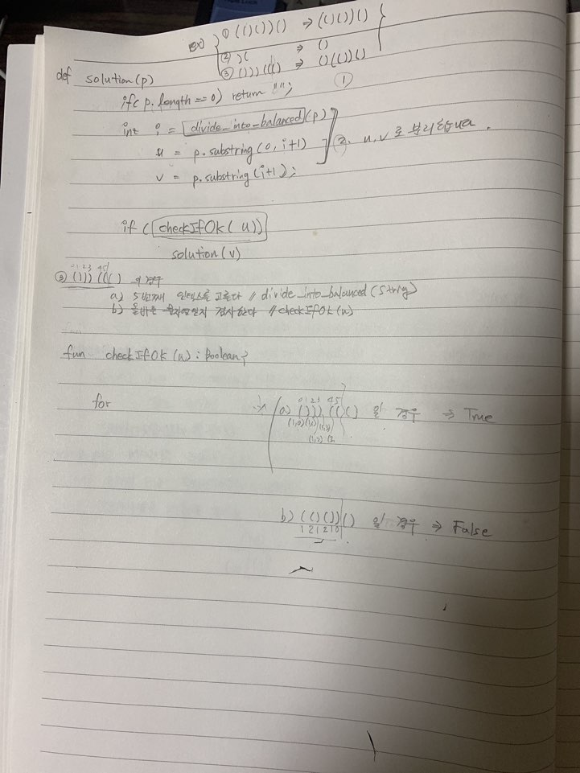

# 문제풀이
> 직접 문제를 풀어볼때는 먼저 그림을 그려봐야 한다. 처음부터 그림을 그려서 순서를 정하는게 좋기때문이다.  
그림을 그리지 않고 "난 할 수 있어" 이런 마인드로 풀수 있는건 굉장히 간단한 문제들만 가능하다. (속닥속닥...마인드가 썩은거다)  

# 20200104 문제 풀이
문제 푸는 과정을 일지처럼 어느정도는 남겨놔야 할 것 같다. 그래야 성취동기가 생겨서 지속적으로 긴장할 것 같다.

