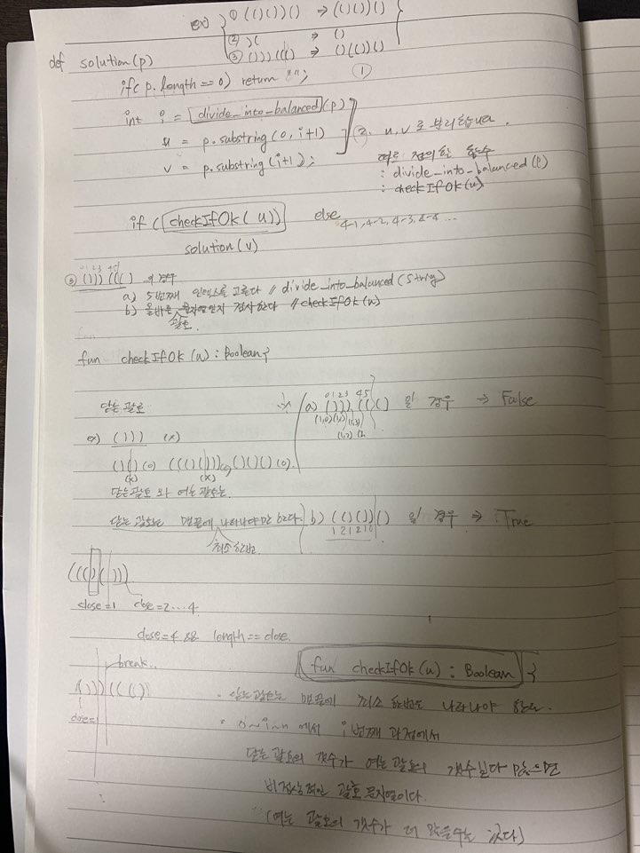

# 문제풀이
> 직접 문제를 풀어볼때는 먼저 그림을 그려봐야 한다. 처음부터 그림을 그려서 순서를 정하는게 좋기때문이다.  
그림을 그리지 않고 "난 할 수 있어" 이런 마인드로 풀수 있는건 굉장히 간단한 문제들만 가능하다. (속닥속닥...마인드가 썩은거다)  
  
문제 푸는 과정을 일지처럼 어느정도는 남겨놔야 할 것 같다. 그래야 성취동기가 생겨서 지속적으로 긴장할 것 같다.

# 문제 풀이
- 20210105
    - 아침 30분
    - fun checkIfOk(bracket: String) : Boolean
    - checkIfOk 라는 함수가 뭘해야 하는지 구상했다.
    - 간단히 요약해보면 아래와 같다.
        - 닫는 괄호는 맨끝에 최소 한 번은 나타나야 한다,
        - 0 .. i .. n 에서 i 번째 과정에서 닫는 괄호의 갯수가 여는 괄호의 갯수보다 많으면 비정상적인 괄호 문자열이다.  
          (여는 괄호의 갯수가 더 많을 수는 있다.)

