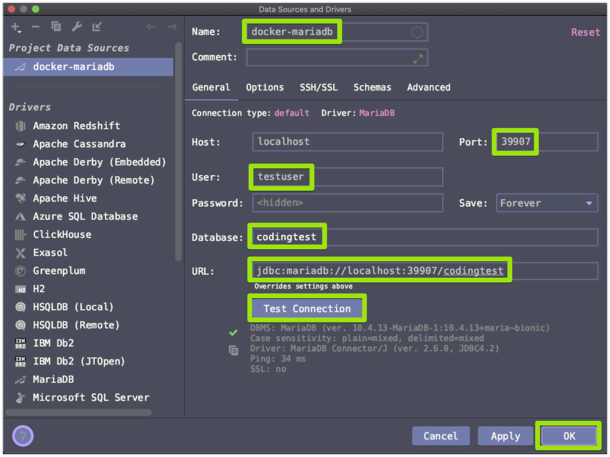

# MariaDB Docker Container 접속환경 안내
# docker 디렉터리로 이동
프로젝트 루트에서 아래의 디렉터리로 이동
```bash
$ cd test/resources/docker
```

# Database 구동 & restart (& volume 초기화)
```bash
$ source docker-mysql-start.sh
```

# Database Shutdown
```bash
$ source docker-mysql-stop.sh
```

# mysql 컨테이너 상태 조회
```bash
$ source docker-mysql-ls.sh
```

# mysql 컨테이너 인스턴스의 컨테이너로 bash 접속
```bash
$ source docker-mysql-repl.sh
```

# 접속정보
- user
    - testuser
- password
    - 1111
- database
    - codingtest
- port
    - 39907  

